```python
%matplotlib inline
import h5py
import os
import pandas as pd
import numpy as np
import matplotlib.pyplot as plt
import glob
```


```python
from sklearn.ensemble import RandomForestClassifier
from sklearn.decomposition import PCA
from sklearn.svm import SVC
from sklearn.multiclass import OneVsRestClassifier
from sklearn.metrics import confusion_matrix, plot_confusion_matrix, plot_roc_curve, f1_score, roc_curve, auc
from sklearn.pipeline import Pipeline
from sklearn.linear_model import LogisticRegression
```


```python
from sklearn.utils import resample
```


```python
skip=['PIG-UPMC-pig55-T0-hgomez-2013-04-15-12-30-10-7']  # ground truth file is blank
```

# Load MCBA 2.0 features


```python
%%time
histmaps = []

histmap_dir='/zfsauton/data/public/mcba/MicroScan_videos_2013/mcba_v2/preprocessed/N200_frames/feat_wHistMap_Hfilters'
for filename in glob.glob('{}/*.mat'.format(histmap_dir)):
    f = h5py.File(filename,'r')
    data = f.get('histMap')
    data = np.array(data)
    
    vid = os.path.basename(filename)
    vid = '-'.join(vid.split('_')[1:]).split('.')[0]
    
    if vid in skip:
        continue
    
    histmaps.append((vid, data.T))
    
histmaps.sort(key=lambda x: x[0])
```

    CPU times: user 22.1 s, sys: 3.89 s, total: 26 s
    Wall time: 30.5 s


# Load labels


```python
def load(ds_dir, skip):
    ds = []
    for filename in glob.glob('{}/*.npy'.format(ds_dir)):
        data = np.load(filename)

        vid = os.path.basename(filename)
        vid = vid.split('_')[0]

        if vid in skip:
            continue    

        ds.append((vid, data))
    ds.sort(key=lambda x:x[0])
    return ds
```


```python
%%time
labels = []
label_dir='/zfsauton/data/public/mcba/MicroScan_videos_2013/ground_truth/'
for filename in glob.glob('{}/*.npy'.format(label_dir)):
    data = np.load(filename)
        
    vid = os.path.basename(filename)
    vid = vid.split('_')[0]
    
    if vid in skip:
        continue    
        
    labels.append((vid, data))
labels.sort(key=lambda x:x[0])
```

    CPU times: user 56.9 ms, sys: 207 ms, total: 264 ms
    Wall time: 2.23 s


```python
%%time
labels = load(ds_dir='/zfsauton/data/public/mcba/MicroScan_videos_2013/ground_truth',
             skip=skip)
```

    CPU times: user 32.2 ms, sys: 147 ms, total: 179 ms
    Wall time: 202 ms


# Merge data


```python
%%time
data = pd.DataFrame()
for idx, ((fname1, histmap), (fname2, label)) in enumerate(zip(histmaps, labels)):    
    df = pd.DataFrame(histmap.reshape(-1, histmap.shape[-1]), columns=['h'+str(i) for i in range(histmap.shape[-1])])
    df['label'] = label.flatten()
    df['id'] = idx
    data = data.append(df, ignore_index=True)
```

    CPU times: user 45.3 s, sys: 39.2 s, total: 1min 24s
    Wall time: 1min 24s


## Save to a file


```python
# data.to_feather('all_data.feather')
```

# Load data


```python
data = pd.read_feather('all_data.feather')
```

## Stats

1. imbalanced classes


```python
data.label.value_counts()
```


    -2.0    13992812
     3.0     2664318
     2.0      321707
     0.0      311962
     1.0      215630
    -1.0       67413
     4.0       51758
    Name: label, dtype: int64


```python
data.label.value_counts(normalize=True)
```


    -2.0    0.793891
     3.0    0.151162
     2.0    0.018252
     0.0    0.017699
     1.0    0.012234
    -1.0    0.003825
     4.0    0.002937
    Name: label, dtype: float64


# Load AVA


```python
%%time
data_ava = load(ds_dir='/zfsauton/data/public/mcba/MicroScan_videos_2013/ava_auto/detected_vessels',
          skip=skip)
```

    CPU times: user 49.5 ms, sys: 156 ms, total: 205 ms
    Wall time: 2.3 s


# Load MCBA 1.0


```python
%%time
mcba_old = load(ds_dir='/zfsauton/data/public/mcba/MicroScan_videos_2013/analysis/overlays',
               skip=skip)

# Fix the truncated name issue
vids = {e[0] for e in histmaps}
mcba_old_renamed = []
for v, data in mcba_old:
    for vid in vids:
        if v in vid:
            mcba_old_renamed.append((vid, data))
            break
mcba_old = mcba_old_renamed
```

    CPU times: user 65.5 ms, sys: 204 ms, total: 270 ms
    Wall time: 1.88 s


```python
rename
```


    {'PIG-UPMC-pig44001-T0-hgomez-2013-01-15-10-03-3': 'PIG-UPMC-pig44001-T0-hgomez-2013-01-15-10-03-37-1',
     'PIG-UPMC-pig44001-T0-hgomez-2013-01-15-10-28-5': 'PIG-UPMC-pig44001-T0-hgomez-2013-01-15-10-28-50-2',
     'PIG-UPMC-pig44001-T0-hgomez-2013-01-15-11-54-5': 'PIG-UPMC-pig44001-T0-hgomez-2013-01-15-11-54-51-5',
     'PIG-UPMC-pig44001-T0-hgomez-2013-01-15-12-09-1': 'PIG-UPMC-pig44001-T0-hgomez-2013-01-15-12-09-11-6',
     'PIG-UPMC-pig44002-T0-hgomez-2013-01-15-14-00-3': 'PIG-UPMC-pig44002-T0-hgomez-2013-01-15-14-00-38-1',
     'PIG-UPMC-pig45001-T0-hgomez-2013-01-17-10-05-33-2': 'PIG-UPMC-pig45001-T0-hgomez-2013-01-17-10-05-33-2',
     'PIG-UPMC-pig45001-T0-hgomez-2013-01-17-11-48-5': 'PIG-UPMC-pig45001-T0-hgomez-2013-01-17-11-48-55-5',
     'PIG-UPMC-pig45001-T0-hgomez-2013-01-17-12-19-1': 'PIG-UPMC-pig45001-T0-hgomez-2013-01-17-12-19-18-6',
     'PIG-UPMC-pig45001-T1-hgomez-2013-01-17-14-14-1': 'PIG-UPMC-pig45001-T1-hgomez-2013-01-17-14-14-17-3',
     'PIG-UPMC-pig47001-T1-hgomez-2013-02-06-10-04-2': 'PIG-UPMC-pig47001-T1-hgomez-2013-02-06-10-04-22-1',
     'PIG-UPMC-pig47001-T1-hgomez-2013-02-06-11-34-0': 'PIG-UPMC-pig47001-T1-hgomez-2013-02-06-11-34-02-3',
     'PIG-UPMC-pig47001-T1-hgomez-2013-02-06-12-01-1': 'PIG-UPMC-pig47001-T1-hgomez-2013-02-06-12-01-13-4',
     'PIG-UPMC-pig49001-T0-hgomez-2013-02-14-10-18-3': 'PIG-UPMC-pig49001-T0-hgomez-2013-02-14-10-18-36-1',
     'PIG-UPMC-pig49001-T1-hgomez-2013-02-14-15-30-1': 'PIG-UPMC-pig49001-T1-hgomez-2013-02-14-15-30-14-3',
     'PIG-UPMC-pig50001-T0-hgomez-2013-02-18-10-08-1': 'PIG-UPMC-pig50001-T0-hgomez-2013-02-18-10-08-12-2',
     'PIG-UPMC-pig50001-T0-hgomez-2013-02-18-10-33-0': 'PIG-UPMC-pig50001-T0-hgomez-2013-02-18-10-33-05-3',
     'PIG-UPMC-pig50001-T0-hgomez-2013-02-18-12-01-5': 'PIG-UPMC-pig50001-T0-hgomez-2013-02-18-12-01-50-5',
     'PIG-UPMC-pig52001-T0-hgomez-2013-02-22-10-53-3': 'PIG-UPMC-pig52001-T0-hgomez-2013-02-22-10-53-32-3',
     'PIG-UPMC-pig52001-T0-hgomez-2013-02-22-11-49-0': 'PIG-UPMC-pig52001-T0-hgomez-2013-02-22-11-49-05-5',
     'PIG-UPMC-pig52001-T0-hgomez-2013-02-22-11-58-1': 'PIG-UPMC-pig52001-T0-hgomez-2013-02-22-11-58-13-6',
     'PIG-UPMC-pig52001-T0-hgomez-2013-02-22-12-23-0': 'PIG-UPMC-pig52001-T0-hgomez-2013-02-22-12-23-00-7',
     'PIG-UPMC-pig52001-T1-hgomez-2013-02-22-14-24-2': 'PIG-UPMC-pig52001-T1-hgomez-2013-02-22-14-24-22-2',
     'PIG-UPMC-pig53001-T0-hgomez-2013-02-26-10-10-1': 'PIG-UPMC-pig53001-T0-hgomez-2013-02-26-10-10-12-1',
     'PIG-UPMC-pig53001-T0-hgomez-2013-02-26-10-47-1': 'PIG-UPMC-pig53001-T0-hgomez-2013-02-26-10-47-15-3',
     'PIG-UPMC-pig53001-T0-hgomez-2013-02-26-11-39-2': 'PIG-UPMC-pig53001-T0-hgomez-2013-02-26-11-39-25-5',
     'PIG-UPMC-pig53001-T0-hgomez-2013-02-26-12-08-1': 'PIG-UPMC-pig53001-T0-hgomez-2013-02-26-12-08-19-7',
     'PIG-UPMC-pig54001-T0-hgomez-2013-02-28-10-11-2': 'PIG-UPMC-pig54001-T0-hgomez-2013-02-28-10-11-22-1',
     'PIG-UPMC-pig54001-T0-hgomez-2013-02-28-11-45-2': 'PIG-UPMC-pig54001-T0-hgomez-2013-02-28-11-45-28-4',
     'PIG-UPMC-pig54001-T0-hgomez-2013-02-28-12-13-4': 'PIG-UPMC-pig54001-T0-hgomez-2013-02-28-12-13-43-5',
     'PIG-UPMC-pig54001-T0-hgomez-2013-02-28-12-38-2': 'PIG-UPMC-pig54001-T0-hgomez-2013-02-28-12-38-25-6',
     'PIG-UPMC-pig55-T0-hgomez-2013-04-15-10-41-0': 'PIG-UPMC-pig55-T0-hgomez-2013-04-15-10-41-06-3',
     'PIG-UPMC-pig55-T0-hgomez-2013-04-15-11-34-0': 'PIG-UPMC-pig55-T0-hgomez-2013-04-15-11-34-04-5',
     'PIG-UPMC-pig55-T0-hgomez-2013-04-15-12-02-3': 'PIG-UPMC-pig55-T0-hgomez-2013-04-15-12-02-39-6',
     'PIG-UPMC-pig56-T0-hgomez-2013-04-25-09-56-2': 'PIG-UPMC-pig56-T0-hgomez-2013-04-25-09-56-26-1',
     'PIG-UPMC-pig56-T0-hgomez-2013-04-25-12-03-0': 'PIG-UPMC-pig56-T0-hgomez-2013-04-25-12-03-05-6',
     'PIG-UPMC-pig56-T1-hgomez-2013-04-25-13-37-4': 'PIG-UPMC-pig56-T1-hgomez-2013-04-25-13-37-48-2',
     'PIG-UPMC-pig57-T0-hgomez-2013-05-08-10-04-0': 'PIG-UPMC-pig57-T0-hgomez-2013-05-08-10-04-04-1',
     'PIG-UPMC-pig57-T0-hgomez-2013-05-08-10-41-0': 'PIG-UPMC-pig57-T0-hgomez-2013-05-08-10-41-06-3',
     'PIG-UPMC-pig57-T0-hgomez-2013-05-08-11-39-3': 'PIG-UPMC-pig57-T0-hgomez-2013-05-08-11-39-38-5',
     'PIG-UPMC-pig57-T0-hgomez-2013-05-08-12-09-5': 'PIG-UPMC-pig57-T0-hgomez-2013-05-08-12-09-57-6',
     'PIG-UPMC-pig58001-T0-hgomez-2013-05-22-12-38-0': 'PIG-UPMC-pig58001-T0-hgomez-2013-05-22-12-38-00-6',
     'PIG-UPMC-pig59001-T0-hgomez-2013-05-24-10-01-4': 'PIG-UPMC-pig59001-T0-hgomez-2013-05-24-10-01-47-1',
     'PIG-UPMC-pig59001-T0-hgomez-2013-05-24-10-59-1': 'PIG-UPMC-pig59001-T0-hgomez-2013-05-24-10-59-13-5',
     'PIG-UPMC-pig59001-T0-hgomez-2013-05-24-11-27-3': 'PIG-UPMC-pig59001-T0-hgomez-2013-05-24-11-27-30-6',
     'PIG-UPMC-pig59001-T0-hgomez-2013-05-24-11-57-2': 'PIG-UPMC-pig59001-T0-hgomez-2013-05-24-11-57-23-7',
     'PIG-UPMC-pig59002-T0-hgomez-2013-05-24-16-09-5': 'PIG-UPMC-pig59002-T0-hgomez-2013-05-24-16-09-54-4',
     'PIG-UPMC-pig60001-T0-hgomez-2013-06-05-10-02-0': 'PIG-UPMC-pig60001-T0-hgomez-2013-06-05-10-02-08-0',
     'PIG-UPMC-pig60001-T0-hgomez-2013-06-05-10-33-1': 'PIG-UPMC-pig60001-T0-hgomez-2013-06-05-10-33-13-2',
     'PIG-UPMC-pig60001-T1-hgomez-2013-06-05-14-59-4': 'PIG-UPMC-pig60001-T1-hgomez-2013-06-05-14-59-40-7',
     'PIG-UPMC-pig61003-T0-hgomez-2013-06-06-15-28-2': 'PIG-UPMC-pig61003-T0-hgomez-2013-06-06-15-28-23-0',
     'PIG-UPMC-pig63001-T0-hgomez-2013-06-10-10-41-5': 'PIG-UPMC-pig63001-T0-hgomez-2013-06-10-10-41-56-3'}


# Inspect MCBA 2.0 features

## visualize vessel detection at various threshold


```python
for (fname1, histmap), (fname2, label)in zip(histmaps, labels):    
    assert(fname1 == fname2)
    fig, (ax1, ax2, ax3, ax4, ax5, ax6) = plt.subplots(1, 6, figsize=(10, 8), dpi=150)
    ax2.imshow(np.sum(histmap, axis=-1) > np.mean(np.sum(histmap, axis=-1)))
    ax2.set_title('Mean')
    ax2.set_axis_off()
    
    ax3.imshow(np.sum(histmap, axis=-1) > np.median(np.sum(histmap, axis=-1)))
    ax3.set_title('Median')
    ax3.set_axis_off()
    
    ax5.imshow(np.sum(histmap>0, axis=-1))
    ax5.set_title('Non zeros')
    ax5.set_axis_off()
    
    ax1.imshow(np.sum(histmap, axis=-1) > np.percentile(np.sum(histmap, axis=-1), 25))
    ax1.set_title('25%')
    ax1.text(0, 0, fname1) 
    ax1.set_axis_off()   
    
    ax4.imshow(np.sum(histmap, axis=-1) > np.percentile(np.sum(histmap, axis=-1), 75))
    ax4.set_title('75%')
    ax4.set_axis_off()   
    
    ax6.imshow(label)
    ax6.set_title('Annotation')
    ax6.set_axis_off()
#     fig.suptitle(fname1)
```

# Train binary classifiers to detect vessels

## A binary label indicating vessel or not
* vessel: label[i] > -2
* non-vessel: lebel[i] == -2

# Split data


```python
%%time
test_id = 50
test_idx = data[data.id == test_id].index
train_idx = data[data.id != test_id].index
X_train, y_train = data.iloc[train_idx, 0:100], (data.label > -2)[train_idx]
X_test, y_test = data.iloc[test_idx, 0:100], (data.label > -2)[test_idx]
```

    CPU times: user 6.9 s, sys: 5.02 s, total: 11.9 s
    Wall time: 11.9 s


```python
y_train.value_counts(normalize=True)
```


    False    0.793523
    True     0.206477
    Name: label, dtype: float64


## Baseline
Use non zeros at each pixel


```python
bin_data = data.filter(like='h').copy()
bin_data[bin_data > 0] = 1
bin_data = pd.concat([bin_data, data[['label', 'id']]], axis=1)
```


```python
y_pred = bin_data.filter(like='h').any(axis=1)
```


```python
accuracy(data.label, y_pred)
```


```python
from sklearn.metrics import ConfusionMatrixDisplay
```


```python
ConfusionMatrixDisplay(confusion_matrix(data.label, y_pred))
```


    <sklearn.metrics._plot.confusion_matrix.ConfusionMatrixDisplay at 0x7f5493757080>


## PCA + RF


```python
%%time
pipe = Pipeline([
    ('pca', PCA(n_components=0.95)), 
    ('clf', RandomForestClassifier(max_samples=5000, random_state=0, n_jobs=-1))
], verbose=True)
pipe.fit(X_train, y_train)
```

    [Pipeline] ............... (step 1 of 2) Processing pca, total=  32.8s
    [Pipeline] ............... (step 2 of 2) Processing clf, total=  31.3s
    CPU times: user 9min 53s, sys: 1min 43s, total: 11min 36s
    Wall time: 1min 4s


    Pipeline(steps=[('pca', PCA(n_components=0.95)),
                    ('clf',
                     RandomForestClassifier(max_samples=5000, n_jobs=-1,
                                            random_state=0))],
             verbose=True)


```python
pipe.score(X_test, y_test)
```


    0.8108043981481482


```python
plot_confusion_matrix(pipe['clf'], pipe['pca'].transform(X_test), y_test, normalize='true')
```


    <sklearn.metrics._plot.confusion_matrix.ConfusionMatrixDisplay at 0x7f52628ce8d0>


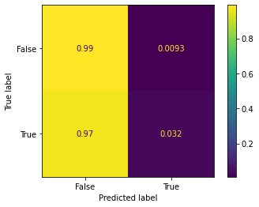


## Downsample background instances


```python
downsampled = resample(data[(data.id != test_id) & (data.label == -2)], replace=False, n_samples=len(data[(data.id != test_id) & (data.label > -2)]), random_state=27)
```


```python
train = downsampled.append(data[(data.id != test_id) & (data.label > -2)])
X_train, y_train = train.iloc[:, 0:100], (train.label > -2)
```


```python
y_train.value_counts(normalize=True)
```


    True     0.5
    False    0.5
    Name: label, dtype: float64


## Now train PCA + RF on the resampled data


```python
%%time
pipe = Pipeline([
    ('pca', PCA(n_components=0.95)), 
    ('clf', RandomForestClassifier(max_samples=5000, random_state=0, n_jobs=-1))
], verbose=True)
pipe.fit(X_train, y_train)
```

    [Pipeline] ............... (step 1 of 2) Processing pca, total=  13.2s
    [Pipeline] ............... (step 2 of 2) Processing clf, total=  12.8s
    CPU times: user 3min 25s, sys: 39.4 s, total: 4min 4s
    Wall time: 26 s


    Pipeline(steps=[('pca', PCA(n_components=0.95)),
                    ('clf',
                     RandomForestClassifier(max_samples=5000, n_jobs=-1,
                                            random_state=0))],
             verbose=True)


```python
pipe.score(X_test, y_test)
```


    0.6176793981481481


```python
plot_confusion_matrix(pipe['clf'], pipe['pca'].transform(X_test), y_test, normalize='true')
```


    <sklearn.metrics._plot.confusion_matrix.ConfusionMatrixDisplay at 0x7f543d0bdd30>


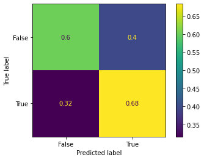


```python
plot_roc_curve(pipe['clf'], pipe['pca'].transform(X_test), y_test)
```


    <sklearn.metrics._plot.roc_curve.RocCurveDisplay at 0x7f543d17b208>


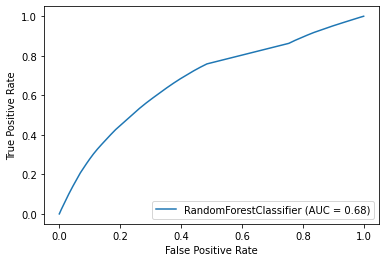


## Try PCA + LR


```python
%%time
pipe = Pipeline([
    ('pca', PCA(n_components=0.95)), 
    ('clf', LogisticRegression(random_state=0, n_jobs=-1))
], verbose=True)
pipe.fit(X_train, y_train)
```

    [Pipeline] ............... (step 1 of 2) Processing pca, total=  14.7s
    [Pipeline] ............... (step 2 of 2) Processing clf, total= 2.1min
    CPU times: user 1min 19s, sys: 17.2 s, total: 1min 36s
    Wall time: 2min 21s


    Pipeline(steps=[('pca', PCA(n_components=0.95)),
                    ('clf', LogisticRegression(n_jobs=-1, random_state=0))],
             verbose=True)


```python
pipe.score(X_test, y_test)
```


    0.7862008101851852


```python
plot_confusion_matrix(pipe['clf'], pipe['pca'].transform(X_test), y_test, normalize='true')
```


    <sklearn.metrics._plot.confusion_matrix.ConfusionMatrixDisplay at 0x7f543cc836a0>


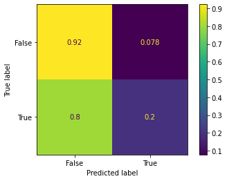


```python
plot_roc_curve(pipe['clf'], pipe['pca'].transform(X_test), y_test)
```


    <sklearn.metrics._plot.roc_curve.RocCurveDisplay at 0x7f543ee497f0>


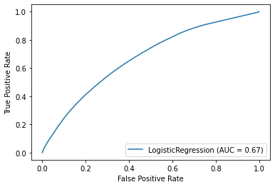


# Compare model performance on the vessel detection
* Binary classification
* Per pixel
* Models
    * AVA (centerline + wall)
    * MCBA 1.0 (centerline only)
    * MCBA 2.0 (centerline + wall)
* Metrics
    * f1
    * accuracy


```python
from sklearn.metrics import accuracy_score
```


```python
def metrics(labels, data_ava, mcba_old, histmaps):
    df = pd.DataFrame(columns=['vid', 'model', 'metric', 'score'])
    for (name, label), (_, ava), (_, old), (_, new) in zip(labels, data_ava, mcba_old, histmaps):
        label, ava, old, new = np.copy(label).flatten(), np.copy(ava).flatten(), np.copy(old).flatten(), np.copy(new)
        label[label > -2] = 1
        label[label <= -2] = 0
        ava[ava > -2] = 1
        ava[ava <= -2] = 0
        old[old > 0] = 1
        h = np.sum(new>0, axis=-1)
        threshold=h.mean()
        h[h<=threshold] = 0
        h[h>threshold] = 1
        h = h.flatten()

        assert(label.shape == h.shape)

        def add_model(model, yhat):
            return (
                df.append(dict(vid=name, model=model, metric='accuracy', score=accuracy_score(label, yhat)), ignore_index=True)
                .append(dict(vid=name, model=model, metric='f1', score=f1_score(label, yhat)), ignore_index=True)
            )

        df = add_model('ava', ava)
        df = add_model('old', old)
        df = add_model('new', h)
    return df
```


```python
%%time
df = metrics(labels, data_ava, mcba_old, histmaps)
```

    CPU times: user 28.3 s, sys: 1.46 s, total: 29.7 s
    Wall time: 29.7 s


## Scores for each video


```python
pd.pivot_table(df, values='score', index=['vid', 'model'], columns='metric')
```


<div>
<style scoped>
    .dataframe tbody tr th:only-of-type {
        vertical-align: middle;
    }

    .dataframe tbody tr th {
        vertical-align: top;
    }

    .dataframe thead th {
        text-align: right;
    }
</style>
<table border="1" class="dataframe">
  <thead>
    <tr style="text-align: right;">
      <th></th>
      <th>metric</th>
      <th>accuracy</th>
      <th>f1</th>
    </tr>
    <tr>
      <th>vid</th>
      <th>model</th>
      <th></th>
      <th></th>
    </tr>
  </thead>
  <tbody>
    <tr>
      <th rowspan="3" valign="top">PIG-UPMC-pig44001-T0-hgomez-2013-01-15-10-03-37-1</th>
      <th>ava</th>
      <td>0.795217</td>
      <td>0.334809</td>
    </tr>
    <tr>
      <th>new</th>
      <td>0.610778</td>
      <td>0.404387</td>
    </tr>
    <tr>
      <th>old</th>
      <td>0.818070</td>
      <td>0.324339</td>
    </tr>
    <tr>
      <th rowspan="2" valign="top">PIG-UPMC-pig44001-T0-hgomez-2013-01-15-10-28-50-2</th>
      <th>ava</th>
      <td>0.790952</td>
      <td>0.341551</td>
    </tr>
    <tr>
      <th>new</th>
      <td>0.654444</td>
      <td>0.430381</td>
    </tr>
    <tr>
      <th>...</th>
      <th>...</th>
      <td>...</td>
      <td>...</td>
    </tr>
    <tr>
      <th rowspan="2" valign="top">PIG-UPMC-pig61003-T0-hgomez-2013-06-06-15-28-23-0</th>
      <th>new</th>
      <td>0.716386</td>
      <td>0.453253</td>
    </tr>
    <tr>
      <th>old</th>
      <td>0.782115</td>
      <td>0.277764</td>
    </tr>
    <tr>
      <th rowspan="3" valign="top">PIG-UPMC-pig63001-T0-hgomez-2013-06-10-10-41-56-3</th>
      <th>ava</th>
      <td>0.750796</td>
      <td>0.183935</td>
    </tr>
    <tr>
      <th>new</th>
      <td>0.671965</td>
      <td>0.409644</td>
    </tr>
    <tr>
      <th>old</th>
      <td>0.746600</td>
      <td>0.175803</td>
    </tr>
  </tbody>
</table>
<p>153 rows × 2 columns</p>
</div>


## Mean score across all videos


```python
pd.pivot_table(df, index=['model'], values='score', columns='metric')
```


<div>
<style scoped>
    .dataframe tbody tr th:only-of-type {
        vertical-align: middle;
    }

    .dataframe tbody tr th {
        vertical-align: top;
    }

    .dataframe thead th {
        text-align: right;
    }
</style>
<table border="1" class="dataframe">
  <thead>
    <tr style="text-align: right;">
      <th>metric</th>
      <th>accuracy</th>
      <th>f1</th>
    </tr>
    <tr>
      <th>model</th>
      <th></th>
      <th></th>
    </tr>
  </thead>
  <tbody>
    <tr>
      <th>ava</th>
      <td>0.761078</td>
      <td>0.300992</td>
    </tr>
    <tr>
      <th>new</th>
      <td>0.674658</td>
      <td>0.427951</td>
    </tr>
    <tr>
      <th>old</th>
      <td>0.789773</td>
      <td>0.277444</td>
    </tr>
  </tbody>
</table>
</div>


# Visualize the model prediction per video


```python
assert(len(histmaps) == len(labels))
for (fname1, histmap), (fname2, label), (fname3, ava), (fname4, old) in zip(histmaps, labels, data_ava, mcba_old):    
    assert(fname1 == fname2)
    fig, (ax1, ax2, ax3, ax4) = plt.subplots(1, 4, figsize=(10, 8), dpi=150)
    ax1.imshow(ava)
    ax1.set_title('AVA')
    ax1.text(0, 0, fname1)
    ax1.set_axis_off()
    ax2.imshow(old)
    ax2.set_title('MCBA old')
    ax2.set_axis_off()
    ax3.imshow(np.sum(histmap>0, axis=-1))
    ax3.set_title('MCBA new')
    ax3.set_axis_off()
    ax4.imshow(label)
    ax4.set_title('Annotation')
    ax4.set_axis_off()
#     fig.suptitle(fname1)
```

    /home/dwang/.conda/envs/mcba-mat/lib/python3.6/site-packages/ipykernel_launcher.py:4: RuntimeWarning: More than 20 figures have been opened. Figures created through the pyplot interface (`matplotlib.pyplot.figure`) are retained until explicitly closed and may consume too much memory. (To control this warning, see the rcParam `figure.max_open_warning`).
      after removing the cwd from sys.path.


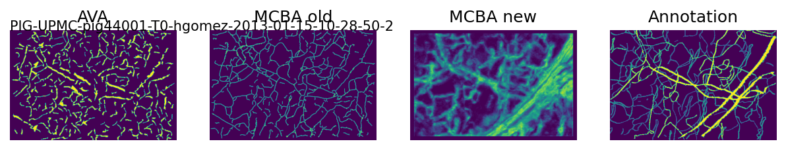


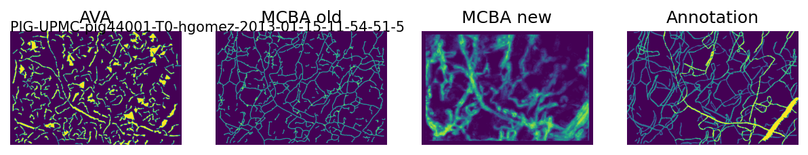


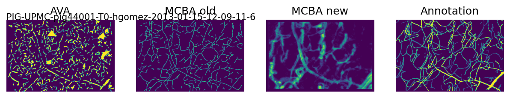


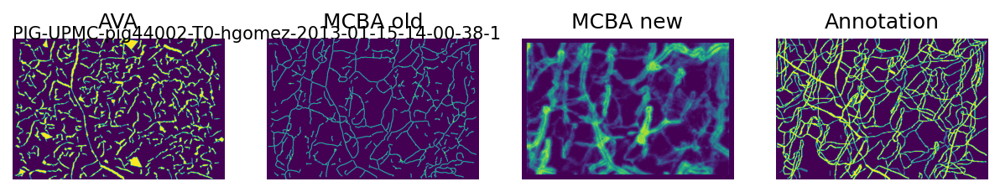


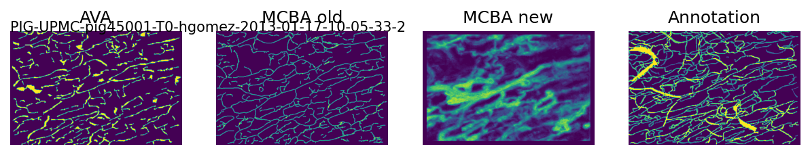


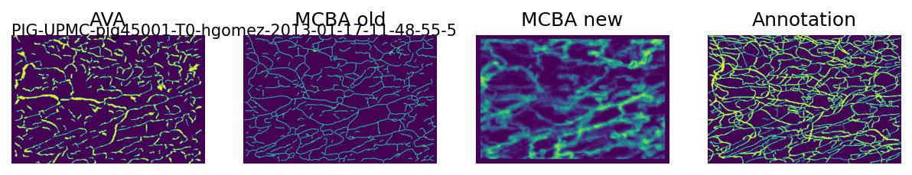


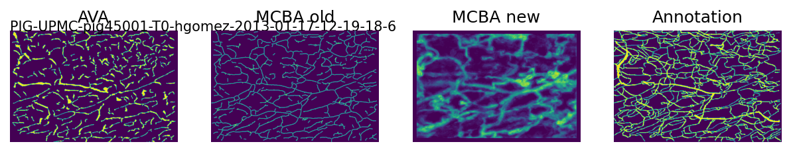


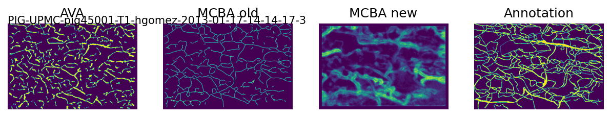


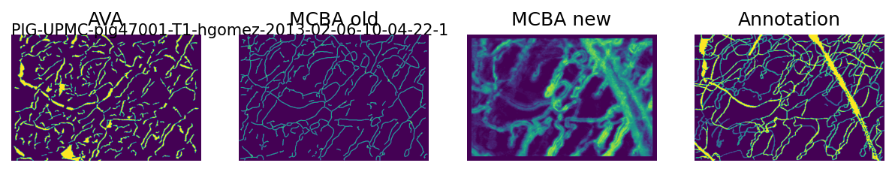


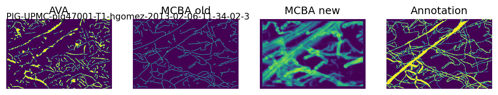


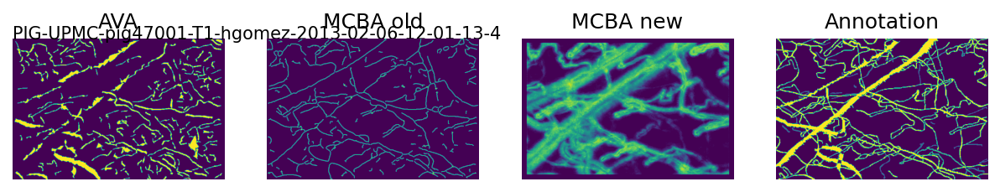


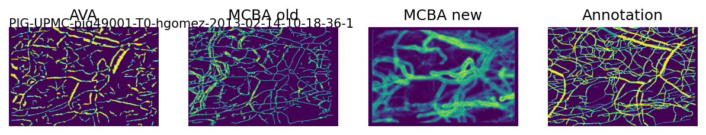


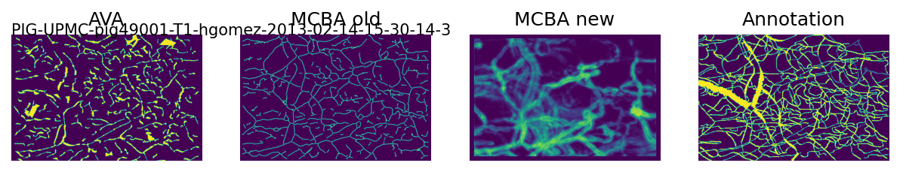


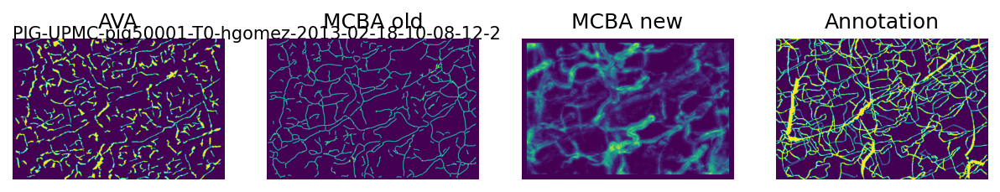


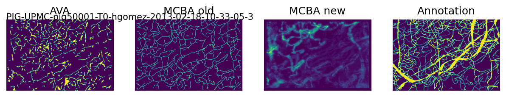


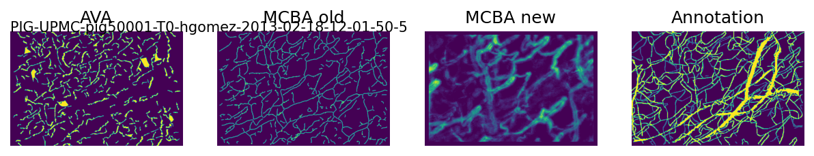


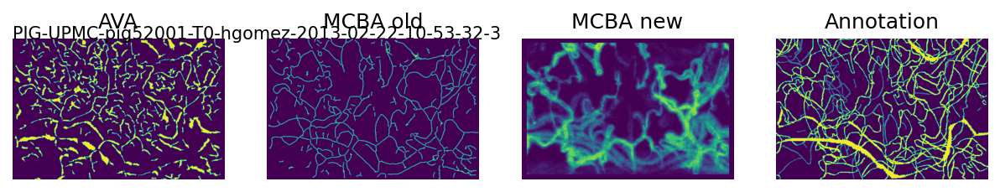


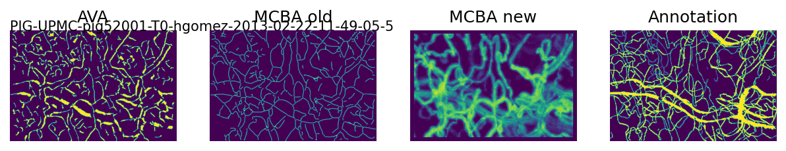


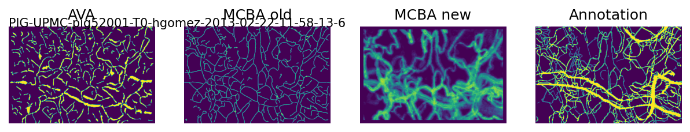


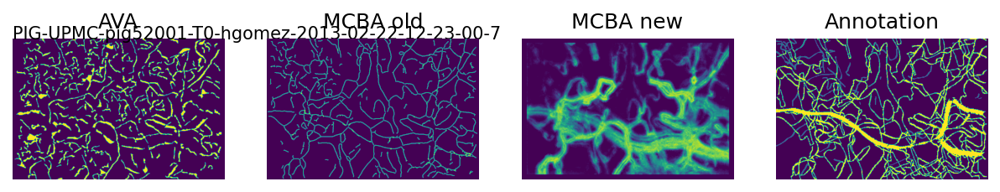


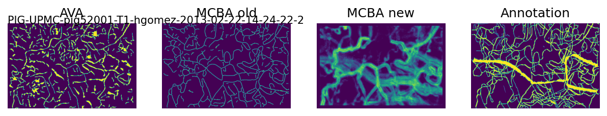


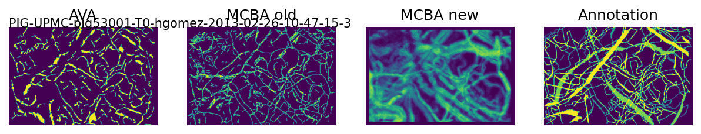


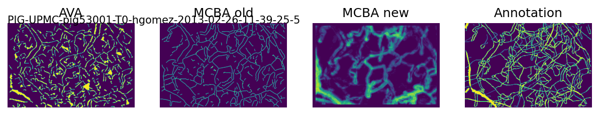


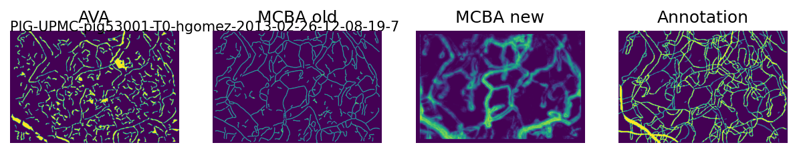


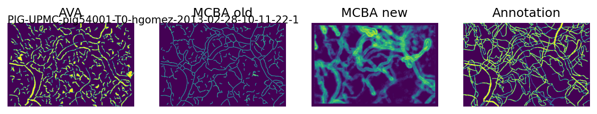


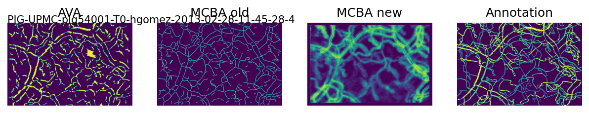


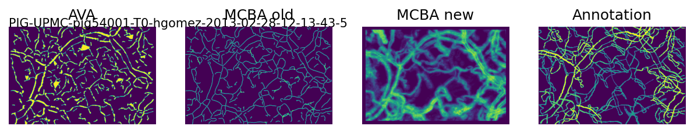


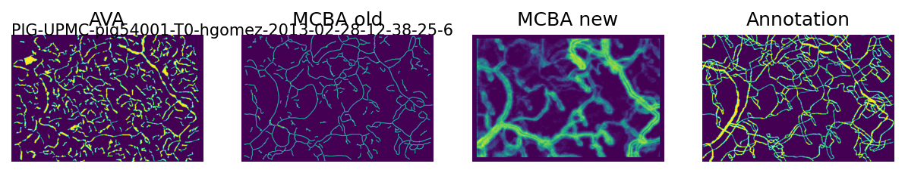


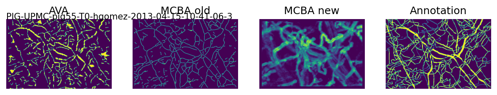


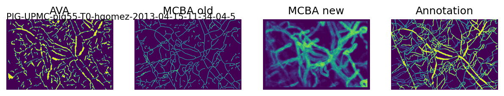


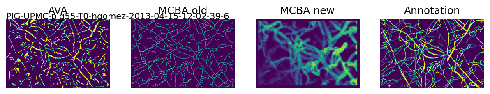


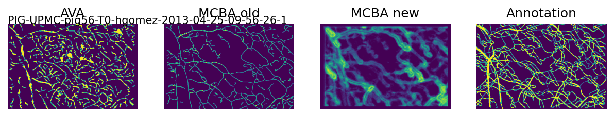


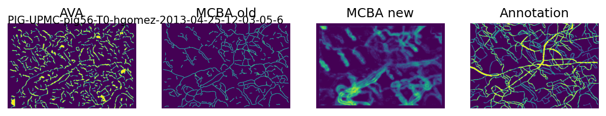


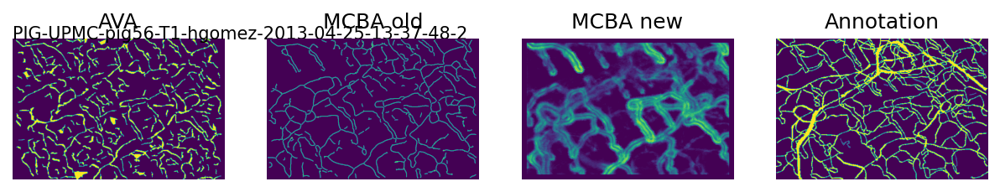


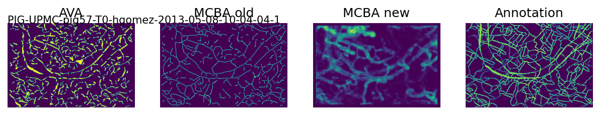


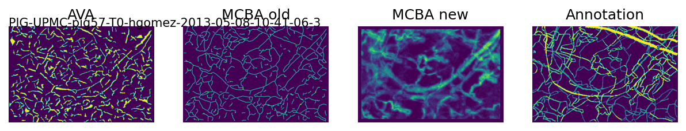


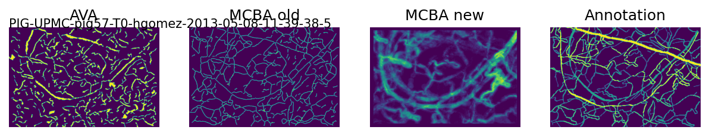


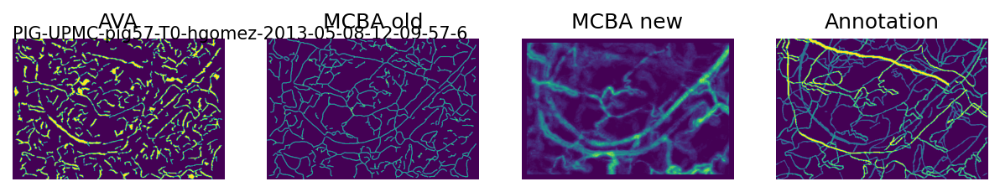


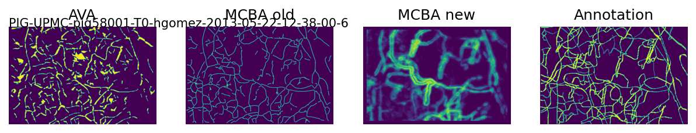


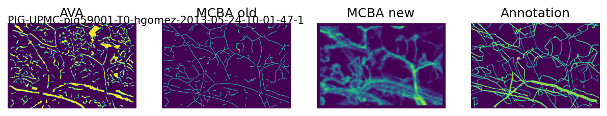


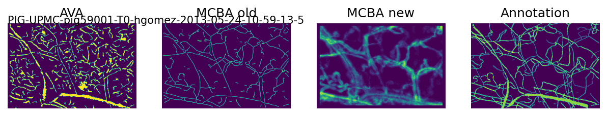


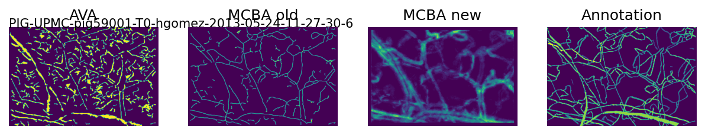


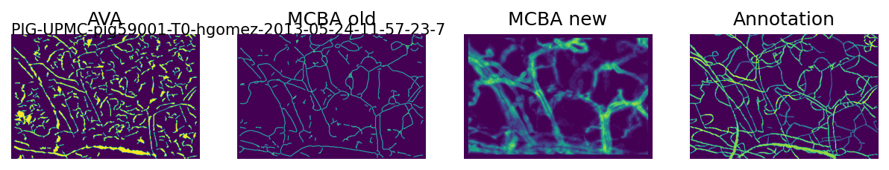


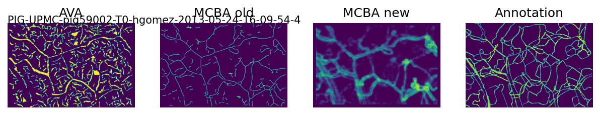


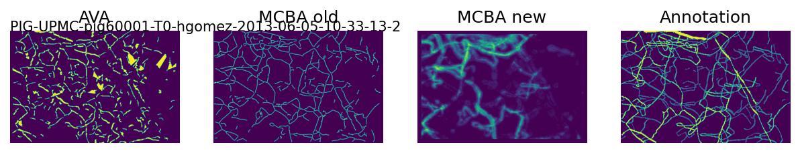


# Split data


```python
%%time
test_id = 50
test_idx = data[(data.id == test_id) & (data.label >= 0)].index
train_idx = data[(data.id != test_id)  & (data.label >= 0)].index
X_train, y_train = data.iloc[train_idx, 0:100], data.iloc[train_idx, 100]
X_test, y_test = data.iloc[test_idx, 0:100], data.iloc[test_idx, 100]
```

    CPU times: user 2.85 s, sys: 940 ms, total: 3.79 s
    Wall time: 3.79 s


```python
X_train.shape
```


    (3500503, 100)


```python
X_test.shape
```


    (64872, 100)


```python
y_train.value_counts(normalize=True)
```


    3.0    0.748081
    2.0    0.090642
    0.0    0.087069
    1.0    0.059700
    4.0    0.014508
    Name: label, dtype: float64


# Random forest classifier


```python
from sklearn.ensemble import RandomForestClassifier
```


```python
%%time
clf = RandomForestClassifier(max_samples=5000, random_state=0, n_jobs=-1)
clf.fit(X_train, y_train)
```

    CPU times: user 1min 25s, sys: 6.17 s, total: 1min 31s
    Wall time: 7.29 s


    RandomForestClassifier(max_samples=5000, n_jobs=-1, random_state=0)


```python
clf.score(X_test, y_test)
```


    0.7059131828832161


```python
y_pred = clf.predict(X_test)
```


```python
from sklearn.metrics import confusion_matrix, plot_confusion_matrix, plot_roc_curve, f1_score
```


```python
plot_confusion_matrix(clf, X_test, y_test)
```


    <sklearn.metrics._plot.confusion_matrix.ConfusionMatrixDisplay at 0x7ff96f146080>


```python
f1_score(y_test, y_pred, average='micro')
```


    0.7059131828832161


# Pipelines with dimension reduction


```python
%%time
pipe = Pipeline([
    ('pca', PCA(n_components=0.95)), 
    ('clf', RandomForestClassifier(max_samples=5000, random_state=0, n_jobs=-1))
], verbose=True)
pipe.fit(X_train, y_train)
```

    [Pipeline] ............... (step 1 of 2) Processing pca, total=   6.7s
    [Pipeline] ............... (step 2 of 2) Processing clf, total=   6.6s
    CPU times: user 1min 57s, sys: 15.2 s, total: 2min 12s
    Wall time: 13.4 s


    Pipeline(steps=[('pca', PCA(n_components=0.95)),
                    ('clf',
                     RandomForestClassifier(max_samples=5000, n_jobs=-1,
                                            random_state=0))],
             verbose=True)


```python
print('Number of compoents: {}'.format(pipe['pca'].n_components_))
```

    Number of compoents: 12


```python
pipe.score(X_test, y_test)
```


    0.7038475767665556


```python
from sklearn.svm import SVC
```


```python
pipe = Pipeline([
    ('pca', PCA(n_components=0.95)), 
    ('clf', SVC(random_state=0))
], verbose=True)
pipe.fit(X_train, y_train)
```

    [Pipeline] ............... (step 1 of 2) Processing pca, total=   6.9s


```python
pipe.score(X_test, y_test)
```


```python
from sklearn.linear_model import LogisticRegression
```


```python
pipe = Pipeline([
    ('pca', PCA(n_components=0.95)), 
    ('clf', LogisticRegression(random_state=0, n_jobs=-1))
], verbose=True)
pipe.fit(X_train, y_train)
```

    [Pipeline] ............... (step 1 of 2) Processing pca, total=   6.8s
    [Pipeline] ............... (step 2 of 2) Processing clf, total= 3.3min


    Pipeline(steps=[('pca', PCA(n_components=0.95)),
                    ('clf', LogisticRegression(n_jobs=-1, random_state=0))],
             verbose=True)


```python
pipe.score(X_test, y_test)
```


    0.7037859168824763


```python
from sklearn.naive_bayes import GaussianNB
```


```python
pipe = Pipeline([
    ('pca', PCA(n_components=0.95)), 
    ('clf', GaussianNB())
], verbose=True)
pipe.fit(X_train, y_train)
```

    [Pipeline] ............... (step 1 of 2) Processing pca, total=   6.5s
    [Pipeline] ............... (step 2 of 2) Processing clf, total=   0.8s


    Pipeline(steps=[('pca', PCA(n_components=0.95)), ('clf', GaussianNB())],
             verbose=True)


```python
pipe.score(X_test, y_test)
```


    0.6923942532988038


```python
plot_confusion_matrix(pipe['clf'], pipe['pca'].transform(X_test), y_test)
```


    <sklearn.metrics._plot.confusion_matrix.ConfusionMatrixDisplay at 0x7f5ce00acc88>


# One vs all classifier


```python
from sklearn.multiclass import OneVsRestClassifier
from sklearn.metrics import roc_curve, auc
```


```python
n_classes = len(y_test.unique())
```


```python
%%time
clf = OneVsRestClassifier(RandomForestClassifier(max_samples=5000, random_state=0, n_jobs=-1), n_jobs=-1)
clf.fit(X_train, y_train)
```

    CPU times: user 1.05 s, sys: 1.15 s, total: 2.2 s
    Wall time: 22.8 s


    OneVsRestClassifier(estimator=RandomForestClassifier(max_samples=5000,
                                                         n_jobs=-1,
                                                         random_state=0),
                        n_jobs=-1)


```python
ax = plt.subplot()
for estimator, label in zip(clf.estimators_, clf.classes_):
    plot_roc_curve(estimator, X_test, y_test, name=label, ax=ax)
ax.plot([0, 1], [0, 1], linestyle='--', lw=2, color='r', label='Chance', alpha=.8)
```


    [<matplotlib.lines.Line2D at 0x7ff93f502cf8>]


# Resample
1. Downsample class=3
1. Upsample class=4
    1. adding noise


```python
from sklearn.utils import resample
```


```python
n_samples = data[(data.id != test_id)  & (data.label == 0)].shape[0]
```


```python
def upsample(label):
    to_upsample_idx = data[(data.id != test_id)  & (data.label == label)].index
    return resample(data.iloc[to_upsample_idx, :], replace=True, n_samples=n_samples, random_state=27)
```


```python
upsampled_4 = upsample(4)
upsampled_1 = upsample(1)
```


```python
to_downsample_idx = data[(data.id != test_id)  & (data.label == 3)].index
downsampled = resample(data.iloc[to_downsample_idx, :], replace=False, n_samples=n_samples, random_state=27)
```


```python
bal_idx = data[(data.id != test_id)  & (data.label.isin([0, 2]))].index
train_bal = data.iloc[bal_idx, :]
for sampled in [upsampled_1, upsampled_4, downsampled]:
    train_bal = train_bal.append(sampled)
train_bal = train_bal.reset_index(drop=True)
```


```python
# Generate training data from the balanced data
X_train, y_train = train_bal.iloc[:, 0:100], train_bal.iloc[:, 100]
```


```python
y_train.value_counts(normalize=True)
```


    2.0    0.206513
    1.0    0.198372
    4.0    0.198372
    3.0    0.198372
    0.0    0.198372
    Name: label, dtype: float64


# Fit on balanced data


```python
%%time
clf = OneVsRestClassifier(RandomForestClassifier(max_samples=5000, random_state=0, n_jobs=-1), n_jobs=-1)
clf.fit(X_train, y_train)
```

    CPU times: user 694 ms, sys: 2.74 s, total: 3.43 s
    Wall time: 12.7 s


    OneVsRestClassifier(estimator=RandomForestClassifier(max_samples=5000,
                                                         n_jobs=-1,
                                                         random_state=0),
                        n_jobs=-1)


```python
ax = plt.subplot()
for estimator, label in zip(clf.estimators_, clf.classes_):
    plot_roc_curve(estimator, X_test, y_test, name=label, ax=ax)
ax.plot([0, 1], [0, 1], linestyle='--', lw=2, color='r', label='Chance', alpha=.8)
```


    [<matplotlib.lines.Line2D at 0x7ff979a29630>]


# Cross Validation
